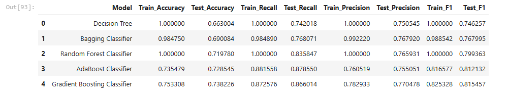
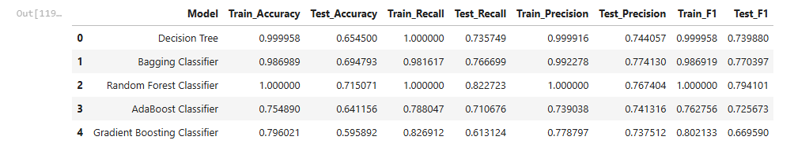
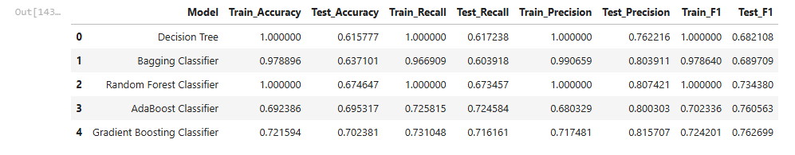
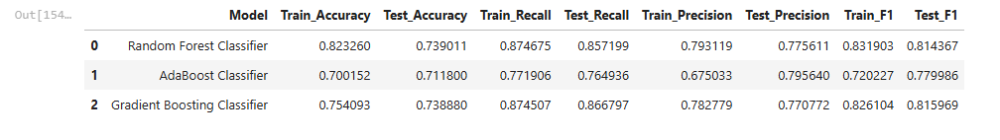

# 🛂 EasyVisa – Visa Approval Prediction using ML

This project aims to predict whether a U.S. visa application will be **Certified** or **Denied** based on applicant features. It uses ensemble learning techniques (Descision tree, Random Forest, Bagging, AdaBoost, Gradient Boosting) to classify visa outcomes and improve understanding of key approval factors.

---

## 🎯 Objective

To build a predictive system that accurately classifies visa applications as **Certified** or **Denied**, by:

- Applying 5 machine learning models:
  - Decision Tree
  - Random Forest
  - AdaBoost
  - Gradient Boosting
  - Bagging Classifier

- Running all 5 models on:
  - **Orginal** data
  - **Oversampled** data
  - **Undersampled** data

- Selecting the top 3 models based on **F1 Score** and then performing:
  - **Hyperparameter tuning** to improve model performance
  - **Final model selection** based on overall performance on unseen data

### Why F1 Score?
F1 Score is chosen as the primary metric because it strikes a balance between:
- **Precision**: Minimizing false positives (wrongly approving denied applicants)
- **Recall**: Minimizing false negatives (wrongly denying qualified applicants)

---

## 🛠️ Tools & Technologies

- **Programming Language**: Python
- **Core Libraries**: Pandas, NumPy, Matplotlib, Seaborn, Scikit-learn
- **Machine Learning Models**:
  - Decision Tree Classifier
  - Random Forest Classifier
  - Bagging Classifier
  - AdaBoost Classifier
  - Gradient Boosting Classifier
- **Model Evaluation**: F1 Score, Precision, Recall, Accuracy
- **Notebook Format**: Jupyter Notebook (`.ipynb`)

---

## 🔍 Key Steps

### 1. Data Cleaning
- Dropped `case_id` after confirming all values were unique and non-informative.
- Fixed negative values in `no_of_employees` to maintain logical consistency.
- Created a new feature `company_age` by subtracting `yr_of_estab` from 2025.
- Standardized `prevailing_wage` to annual wage based on `unit_of_wage` values.

### 2. Exploratory Data Analysis (EDA)
- Visualized distributions of features and how they relate to `Visa Status`.
- Analyzed trends by `Education`, `Job Title`, and `Employer Name`.

### 3. Data Preprocessing
- Encoded categorical variables using a combination of:
  - Label Encoding (for ordinal or binary columns)
  - One-Hot Encoding (for nominal variables)
- Ensured feature consistency and model-readiness for ML algorithms.

### 4. Model Building & Evaluation
- Built classification models using:
  - Decision Tree
  - Random Forest
  - Bagging Classifier
  - AdaBoost Classifier
  - Gradient Boosting Classifier
- Trained models on both oversampled and undersampled datasets.
- Selected top 3 models based on F1 Score for further hyperparameter tuning.
- Evaluated performance using:
  - Accuracy
  - Precision
  - Recall
  - F1 Score

---

## 📸 Model Comparison & Evaluation

To track model performance across different sampling techniques and after tuning, the following result tables summarize accuracy, precision, recall, and F1 score for each model:

### 1. 🔄 Original Data (Imbalanced)

### 2. ⬆️ Oversampled Data (Balanced)

### 3. ⬇️ Undersampled Data (Balanced)

### 4. 🧪 Final Tuned Models

---

## 📊 Key Insights

- **Gradient Boosting Classifier** (after hyperparameter tuning) emerged as the top-performing model with the highest F1 score (0.816), precision (77.1%), and recall (86.7%). It demonstrated excellent generalization and minimal overfitting.
- **Random Forest Classifier** also performed competitively, achieving a test F1 score of 0.814 with slightly higher recall, making it a strong alternative.
- **AdaBoost Classifier**, while slightly behind in F1 score (0.780), still offered balanced and stable performance, contributing to model robustness.
- **Key predictive features** across all models include: `education_of_employee`, `prevailing_wage`, `company_age`, and `no_of_employees`. These factors play a major role in determining visa outcomes.
- **Imbalanced classes** (more Certified than Denied) required oversampling and undersampling techniques to improve model fairness and evaluation stability.
- **EDA revealed** that applicants with advanced degrees (Master’s, Doctorate), full-time roles, and higher wages had significantly higher approval rates.
- **Tree-based models were chosen** because they naturally handle skewed distributions and outliers, which were present in features like `no_of_employees` and `prevailing_wage`.
- This model can be deployed in a **visa screening support system**, helping automate and prioritize application decisions, reducing manual review effort and increasing consistency.

---

## 💼 Business Impact

- Predictive models can support pre-screening and prioritize high-probability applicants.
- Helps reduce manual screening load and ensure fairness in high-volume visa seasons.
- Key features can inform future immigration policy and education/employment alignment.

---

## 🙋 Contact

Created by **Bilal Abdul Sathar**  
📧 Email: [bilalasathar@gmail.com](mailto:bilalasathar@gmail.com)  
🔗 LinkedIn: [linkedin.com/in/bilalas](https://www.linkedin.com/in/bilalas)  
